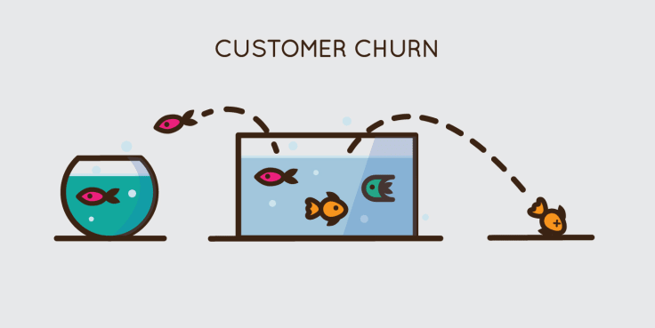

# Churn-Prediction-Investment-Company
Predict the probability of Customer Churn using Historical Customer data and Customer Features

## What is churn?
Churn Prediction is an important problem that is beneficial for a number of companies. In companies such as Netflix where your major revenue is dependent on customer retention it is very important to identify customers who are most likely to leave/unsubsribe from your service and more over find the factors leading to churn.

## What causes churn?
This the question we are trying to answer. While there maybe numerous reasons why a customer decides to stop using services. It is possible to find patterns in factors/features of a customer profile to be able to predict churn.

## Use of predicting churn
It would be most beneficial to understand that if a group of customers who are depending on a certain service is causing and issue. Predicting the group of users and their common attribute could help triangulate the source of problem and eliminate it before churn.

More at [Churn Prediction Notebook](https://github.com/AshwinDeshpande96/Churn-Prediction-Investment-Company/blob/main/Churn%20Prediction.ipynb)
